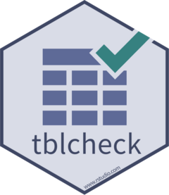

<!-- README.md is generated from README.Rmd. Please edit that file -->

# tblcheck 

<!-- badges: start -->

[](https://CRAN.R-project.org/package=tblcheck)
[](https://github.com/rstudio/tblcheck/actions)
<!-- [](https://cran.r-project.org/package=tblcheck) -->
<!-- badges: end -->

tblcheck provides functions for grading tibbles, data frames, and
vectors with [gradethis](https://pkgs.rstudio.com/gradethis/).

gradethis is designed for use with
[gradethis](https://pkgs.rstudio.com/gradethis/) in
[learnr](https://rstudio.github.io/learnr/) tutorials. We recommend that
you first be comfortable grading
[learnr](https://rstudio.github.io/learnr/) tutorials with
[gradethis](https://pkgs.rstudio.com/gradethis/) before you begin using
tblcheck. You can learn more with the [gradethis package
documentation](https://pkgs.rstudio.com/gradethis/) and the [learnr
package documentation](https://rstudio.github.io/learnr/).


## Installation

<!-- You can install the released version of tblcheck from [CRAN](https://CRAN.R-project.org) with: -->
<!-- ``` r -->
<!-- install.packages("tblcheck") -->
<!-- ``` -->

tblcheck is still in development and not on
[CRAN](https://CRAN.R-project.org) yet. The development version of
tblcheck can be installed from GitHub with:

``` r
# install.packages("remotes")
remotes::install_github("rstudio/tblcheck")
```

## Usage

To use tblcheck in a learnr tutorial, start by loading tblcheck after
learnr and gradethis in the `setup` chunk of your tutorial:

```` markdown
```{r setup}
library(learnr)
library(gradethis)
library(tblcheck)
library(tibble)
```
````

Then include one of the tblcheck functions in your gradethis code:

```` markdown
```{r exercise, exercise = TRUE}

```

```{r exercise-solution}
tibble(fruit = "tomato", color = "red")
```

```{r exercise-check}
grade_this_table()
```
````

`grade_this_table()` compares the `.result` generated by a students’
code to the `.solution` generated in the `exercise-solution` chunk.

-   `grade_this_table()` passes the student’s `.result` if it’s
    identical to the `.solution`, or if a difference is detected, it
    produces a failing grade with a message describing the problem with
    the table.

-   `grade_this_table()` is built on gradethis functions and
    `tbl_grade()`, which can be used in exercise grading code to detect
    problems in tables.

-   `tbl_grade()`, in turn, is built on lower-level functions that can
    be used directly to compare specific aspects of two tables.

Learn more about the various tblcheck functions in
`vignette("tblcheck")`.

## Code of Conduct

Please note that the tblcheck project is released with a [Contributor
Code of
Conduct](https://contributor-covenant.org/version/2/0/CODE_OF_CONDUCT.html).
By contributing to this project, you agree to abide by its terms.
